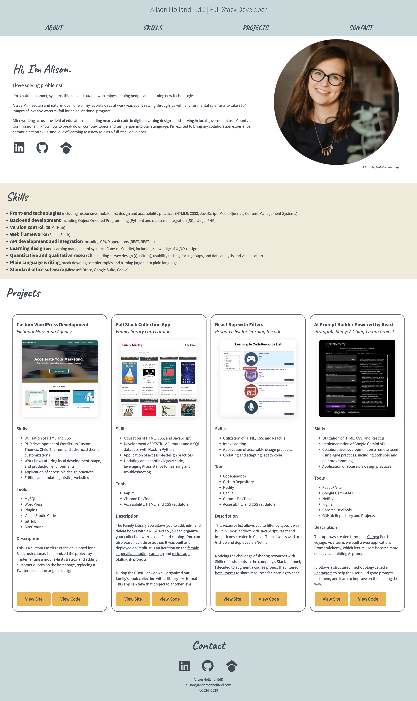

#Portfolio Site
This portfolio site was created to showcase my web development skills, with a strong focus on clean code, responsive design, and digital accessibility best practices.

  

##Acknowledgements
This site was originally developed as the final project of my Skillcrush Full Stack Development training, with guidance from their Get Hired program on best practices for portfolio content. It was later updated following the completion of their WordPress Development courses.

Developed with portions of the HTML5 Boilerplate.

Copyright (c) HTML5 Boilerplate

Permission is hereby granted, free of charge, to any person obtaining a copy of
this software and associated documentation files (the "Software"), to deal in
the Software without restriction, including without limitation the rights to
use, copy, modify, merge, publish, distribute, sublicense, and/or sell copies
of the Software, and to permit persons to whom the Software is furnished to do
so, subject to the following conditions:

The above copyright notice and this permission notice shall be included in all
copies or substantial portions of the Software.
